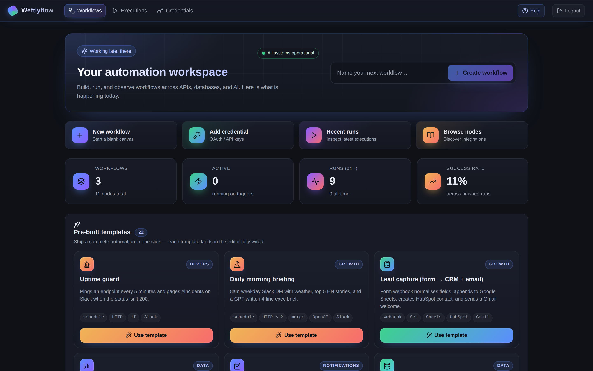
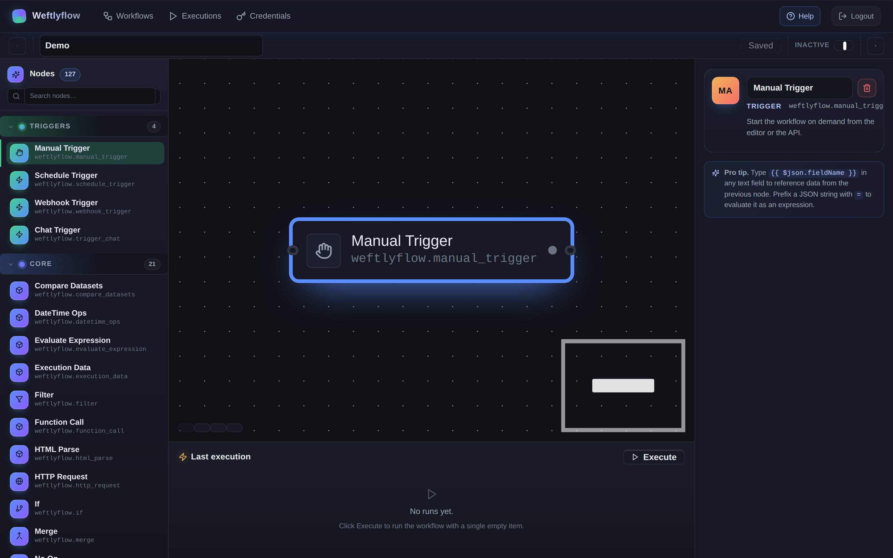

# Weftlyflow

> Self-hosted workflow automation platform — visual node-graph editor, triggers, AI agents, 100+ integrations. Python backend, Vue 3 frontend.

Weftlyflow is an **independent, clean-room Python implementation** inspired by n8n's
architecture. The canonical project plan lives in
[`IMPLEMENTATION_BIBLE.md`](./IMPLEMENTATION_BIBLE.md) — treat it as the source of truth
for design and contribution rules.

## Screenshots

### Dashboard

Workflow list, live KPIs, pre-built templates, integration gallery, quick actions.



### Workflow editor

Three-pane editor: searchable node palette (127 nodes across triggers / core / integrations / AI), Vue Flow canvas, parameter inspector with live expression hints.



## Status

**Version `1.0.0`.** Phases 0–5 complete; phase 6 (integration nodes) is the active
expansion track; phase 7 (AI) ships a working baseline; phase 8 hardening (sandbox,
SSO, external-secrets, Helm chart, audit retention, fuzz suite) is complete.

| Phase | Scope | State |
|---|---|---|
| 0 | Repo bootstrap, tooling, IP/clean-room rules | ✅ |
| 1 | Domain model, execution engine, expression sandbox | ✅ |
| 2 | Persistence, FastAPI surface, auth, RBAC | ✅ |
| 3 | Worker, webhook ingress, scheduler, triggers | ✅ |
| 4 | Credentials vault (Fernet), expression engine v2 | ✅ |
| 5 | Frontend MVP (editor, executions, credentials) | ✅ |
| 6 | Integration nodes — 85+ shipped, more landing | 🚧 |
| 7 | AI nodes — agents, memory, vector stores, guardrails | ✅ baseline |
| 8a | Sandbox hardening, expression timeouts, redaction | ✅ |
| 8b | Subprocess runner, fuzz suite, SSO, external secrets, audit retention | ✅ |

## What's in the box

| | Count |
|---|---:|
| Built-in nodes | **127** (4 triggers · 21 core · 85 integrations · 17+ AI) |
| Credential types | **89** |
| Workflow templates | **22** (one-click installs) |
| Backend tests | **172 files** (`unit/`, `integration/`) |
| Phases delivered | **0–5 + 8a + 8b**, plus an AI baseline |

### Triggers

`weftlyflow.manual_trigger` · `weftlyflow.schedule_trigger` (cron / interval) · `weftlyflow.webhook_trigger` · `weftlyflow.trigger_chat`

### Core nodes (21)

Routing & flow: `if`, `switch`, `merge`, `filter`, `split_in_batches`, `wait`, `no_op`, `stop_and_error`.
Data shaping: `set`, `rename_keys`, `transform`, `evaluate_expression`, `compare_datasets`.
HTTP & code: `http_request`, `code` (RestrictedPython sandbox), `function_call`.
Parsing & files: `html_parse`, `xml_parse`, `datetime_ops`, `read_binary_file`, `write_binary_file`, `execution_data`.

### Integrations (85+)

Communication: Slack · Discord · Telegram · MS Teams · Twilio · SendGrid · Mailgun · SMTP · IMAP.
Engineering: GitHub · GitLab · Bitbucket · Jira · Linear · PagerDuty · Sentry.
Productivity: Notion · Asana · ClickUp · Trello · Monday · Airtable · Google Sheets · Google Drive · Gmail · Box · Dropbox.
Sales / CRM: Salesforce · HubSpot · Pipedrive · Intercom · Zendesk · Zoho · Mailchimp.
Commerce / payments: Stripe · Shopify · QuickBooks · Square.
Cloud / data: AWS S3 · DynamoDB · Postgres · MySQL · MongoDB · Redis.
…and ~40 more.

### AI nodes (17+)

LLM providers: OpenAI · Anthropic · Cohere · local OpenAI-compatible.
Agents & memory: `agent_react`, `agent_tool_dispatch`, `agent_tool_result`, `memory_buffer`, `memory_window`, `memory_summary`.
Retrieval: `embed_openai`, `embed_local`, `text_splitter`, `vector_chroma`, `vector_pgvector`, `vector_pinecone`, `vector_qdrant`, `vector_memory`.
Guardrails: `guard_jailbreak_detect`, `guard_pii_redact`, `guard_schema_enforce`.
Conversational: `trigger_chat`, `chat_respond`.

## Stack

- **Backend** — Python 3.12 (3.11 supported), FastAPI, SQLAlchemy 2, Alembic, Pydantic v2, Celery + Redis, APScheduler, RestrictedPython, structlog, httpx, `cryptography` (Fernet).
- **Frontend** — Vue 3 (Composition API), Pinia, Vue Router, Vue Flow, CodeMirror 6, Tailwind v4, Vite, TypeScript 5.
- **Tooling** — pip + hatch (PEP 621), ruff, black, `mypy --strict`, pytest (+ `respx`, `hypothesis`, `xdist`), Playwright, pre-commit, mkdocs-material + mkdocstrings.
- **Infra** — Docker + docker-compose, Postgres (prod) / SQLite (dev), Redis.
- **Auth & secrets** — argon2 + JWT, RBAC, optional TOTP, OIDC + SAML SSO, external-secrets protocol (AWS Secrets Manager out of the box).

## Quickstart

### Docker (recommended)

```bash
cp .env.example .env
docker compose up -d                     # postgres, redis, api, worker, beat
docker compose exec api alembic upgrade head
cd frontend && npm install && npm run dev   # UI on http://localhost:5173
```

API on `http://localhost:5678` (`/healthz`, `/api/v1/...`). Default bootstrap admin
is generated on first boot (password printed once, redacted on subsequent logs).
Pre-seed deterministically with `WEFTLYFLOW_BOOTSTRAP_ADMIN_EMAIL` and
`WEFTLYFLOW_BOOTSTRAP_ADMIN_PASSWORD` in `.env`.

### Native dev (no Docker)

```bash
python -m venv .venv && source .venv/bin/activate
pip install -e ".[dev,docs,ai]"
cp .env.example .env
make db-upgrade
make dev-api        # http://localhost:5678
make dev-worker     # separate shell
make dev-beat       # separate shell
make dev-frontend   # http://localhost:5173
make docs-serve     # http://localhost:8000 (optional)
```

The local CI gate is `make lint && make typecheck && make test`.

### Capturing fresh screenshots

After running the stack:

```bash
cd frontend && node scripts/capture_screenshots.mjs
```

Outputs `docs/images/dashboard.png` and `docs/images/workflow-editor.png`.

## Layout

```
src/weftlyflow/        backend Python package (domain, engine, nodes, server, worker, …)
frontend/              Vue 3 + Vite + TS app
docs/                  mkdocs source + screenshots
tests/                 backend tests (unit/, integration/)
docker/                Dockerfiles per service (api, worker, beat)
alembic/               DB migrations (handled by `make db-upgrade`)
.claude/               Claude Code config (agents, skills, MCP)
```

Full tree + rationale is in the bible.

## Documentation

- Design & roadmap — [`IMPLEMENTATION_BIBLE.md`](./IMPLEMENTATION_BIBLE.md)
- Operator guide — `make docs-serve` then http://localhost:8000
- UI walkthrough — [`docs/guide/ui-walkthrough.md`](./docs/guide/ui-walkthrough.md)
- Run script — [`RUN.md`](./RUN.md)

## Licensing & IP

Weftlyflow is original code. It is **not** a fork of n8n. See §23 of the bible for
the clean-room rules every contribution must follow — no copied code, no copied
identifiers, no copied node names or credential slugs.

## Contributing

Every new node, credential type, or architectural change must preserve the
conventions in §22 of the bible: strict typing, Google-style docstrings, AAA
tests, layer boundaries (`server / worker / webhooks / triggers → engine →
nodes / credentials / expression → domain`), no `print()` in library code.
