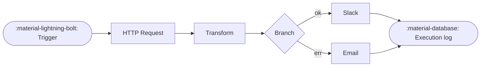

---
hide:
  - navigation
  - toc
---

:octicons-rocket-16: Pre-alpha — Phase 0 in progress

# Weftlyflow

Self-hosted workflow automation — visual node-graph editor, triggers, polling,
hundreds of integrations, and AI agents. Original Python implementation, Vue 3 frontend.

[:octicons-rocket-16: Get started](getting-started/install.md){ .md-button .md-button--primary }
[:octicons-mark-github-16: View on GitHub](https://github.com/aignishant/weftlyflow){ .md-button }
[:octicons-book-16: API reference](reference/index.md){ .md-button }

## Why Weftlyflow

-   :material-graph-outline:{ .lg .middle } &nbsp;**Visual node-graph editor**

    ---

    Drag nodes onto a canvas, wire them up, and watch items flow through. Vue 3 + Vue Flow under the hood.

    [:octicons-arrow-right-16: UI walkthrough](guide/ui-walkthrough.md)

-   :material-clock-fast:{ .lg .middle } &nbsp;**Triggers that just work**

    ---

    Webhooks, cron, polling, and event triggers managed by a single APScheduler-driven lifecycle.

    [:octicons-arrow-right-16: Triggers & schedules](guide/triggers-and-schedules.md)

-   :material-code-braces:{ .lg .middle } &nbsp;**Expressions everywhere**

    ---

    `{{ ... }}` templating backed by RestrictedPython. Compose values across nodes without writing code.

    [:octicons-arrow-right-16: Expressions guide](guide/expressions.md)

-   :material-robot-outline:{ .lg .middle } &nbsp;**AI agents, first-class**

    ---

    Build chat-triggered agents, route across providers, and persist conversation memory between runs.

    [:octicons-arrow-right-16: AI & agents](guide/ai-and-agents.md)

-   :material-shield-lock-outline:{ .lg .middle } &nbsp;**Credentials, sealed**

    ---

    Pluggable credential types with Fernet-encrypted storage. Optional external secrets for AWS / Vault.

    [:octicons-arrow-right-16: Credentials](guide/credentials.md)

-   :material-server-network:{ .lg .middle } &nbsp;**Self-host, your rules**

    ---

    Run on Docker, bare metal, or Kubernetes. Multi-tenant, SSO-ready, audit-friendly.

    [:octicons-arrow-right-16: Self-hosting](guide/self-hosting.md)

## How it works

A workflow is a directed graph of **nodes** connected by edges. A node is either an **action** (call an API, transform data, run code) or a **trigger** (webhook, cron, poll). When a trigger fires, the engine walks the graph, passing **items** from node to node, and writes an **execution** record you can inspect afterwards.

## Quick links

-   :material-map-outline: &nbsp;**[Architecture](architecture.md)** — the big picture in one page.
-   :material-package-down: &nbsp;**[Install](getting-started/install.md)** — Docker or pip.
-   :material-flag-checkered: &nbsp;**[Your first workflow](getting-started/first-workflow.md)** — five-minute tour.
-   :material-puzzle-outline: &nbsp;**[Add a node](contributing/node-plugins.md)** — write a new integration.
-   :material-key-variant: &nbsp;**[Add a credential](contributing/credential-plugins.md)** — pluggable secret types.
-   :material-book-open-variant: &nbsp;**[API reference](reference/index.md)** — auto-generated from docstrings.

!!! info "Provenance"
    Weftlyflow is an **original, independent Python implementation**. It is not a fork. See [`weftlyinfo.md §23`](https://github.com/aignishant/weftlyflow/blob/main/weftlyinfo.md) for the clean-room rules every contribution must follow.
