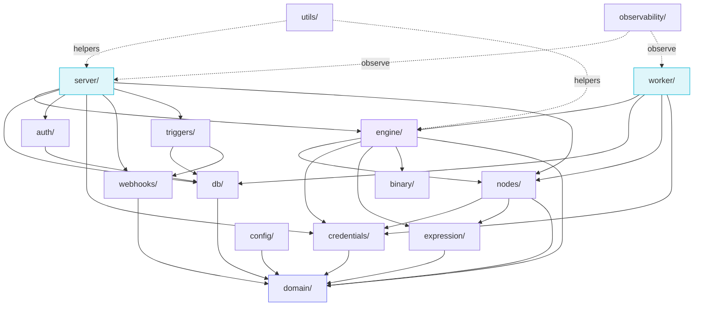

# Backend Walkthrough

> The Python package `weftlyflow` lives in `src/weftlyflow/`. Thirteen
> subpackages, layered. This page is a map; each card links to a deep-dive.

## The dependency rule

Read this once and keep it in your head:

```
server, worker, webhooks, triggers
        │
        ▼
      engine ──► nodes ─► credentials, expression
        │                       │
        ▼                       ▼
      domain ◄────────── domain (no outbound imports)
```

- **`domain/`** has no inbound imports from the rest of the project.
- **`engine/`** imports `domain/` and is imported by `nodes/`, `server/`, `worker/`.
- **`server/`, `worker/`, `triggers/`, `webhooks/`** are *boundary layers* — they
  may import everything below them but **never each other**.

This is enforced in PR review. If a `domain/` module sprouts an `import
weftlyflow.server`, the change is rejected on principle.

## The 13 subpackages, by layer

<div class="grid cards" markdown>

-   :material-cube-outline:{ .lg .middle } &nbsp;**Layer 0 — Pure model**

    ---

    **`domain/`** — `Workflow`, `Node`, `Connection`, `Execution`, `Item`,
    `NodeSpec`, `PropertySchema`, error types, ID generators. Zero IO.

    [:octicons-arrow-right-16: Domain → Engine → Nodes](domain-engine-nodes.md)

-   :material-engine:{ .lg .middle } &nbsp;**Layer 1 — Execution**

    ---

    **`engine/`** — `WorkflowExecutor`, `WorkflowGraph`, `RunState`,
    `ExecutionContext`, `LifecycleHooks`, `SubWorkflowRunner`. The pure heart
    of the system.

    [:octicons-arrow-right-16: Domain → Engine → Nodes](domain-engine-nodes.md)

-   :material-puzzle-outline:{ .lg .middle } &nbsp;**Layer 2 — Plugins**

    ---

    **`nodes/`** — `BaseNode` + `NodeRegistry` + 86 built-in integrations
    plus core nodes (HTTP, Code, IF, Switch, Merge, Set, Filter, …) and the
    AI agent + memory + vector nodes.

    [:octicons-arrow-right-16: Domain → Engine → Nodes](domain-engine-nodes.md)

-   :material-code-tags:{ .lg .middle } &nbsp;**Layer 2 — Expression**

    ---

    **`expression/`** — `{{ ... }}` template engine: `tokenizer`, `sandbox`,
    `proxies` (`$json`, `$now`, `$input`, `$node`), `resolver`. Backed by
    RestrictedPython.

    [:octicons-arrow-right-16: Auth, Credentials, Expression](auth-credentials-expression.md)

-   :material-key-variant:{ .lg .middle } &nbsp;**Layer 2 — Credentials**

    ---

    **`credentials/`** — Fernet cipher, credential type registry (~80 types),
    DB resolver, external secret providers (Vault, 1Password, AWS Secrets,
    Env).

    [:octicons-arrow-right-16: Auth, Credentials, Expression](auth-credentials-expression.md)

-   :material-account-key:{ .lg .middle } &nbsp;**Layer 3 — Auth**

    ---

    **`auth/`** — Argon2 passwords, JWT, RBAC scopes, MFA, SSO (OIDC + SAML
    + nonce store + state token).

    [:octicons-arrow-right-16: Auth, Credentials, Expression](auth-credentials-expression.md)

-   :material-database-outline:{ .lg .middle } &nbsp;**Layer 4 — Persistence**

    ---

    **`db/`** — SQLAlchemy 2.x typed entities, repositories, mappers,
    Alembic migrations, execution-data storage (db / fs / s3).

    [:octicons-arrow-right-16: Server & DB](server-db.md)

-   :material-server:{ .lg .middle } &nbsp;**Layer 5 — API**

    ---

    **`server/`** — FastAPI app + lifespan + routers (auth, workflows,
    executions, credentials, oauth2, sso, webhooks-ingress, node-types,
    health, metrics) + middleware + persistence hooks.

    [:octicons-arrow-right-16: Server & DB](server-db.md)

-   :material-clock-outline:{ .lg .middle } &nbsp;**Layer 5 — Triggers**

    ---

    **`triggers/`** — `ActiveTriggerManager`, `Scheduler` (APScheduler),
    `LeaderLock` (single-firer election), `Poller`.

    [:octicons-arrow-right-16: Triggers, Worker, Webhooks](triggers-worker-webhooks.md)

-   :material-cog-transfer:{ .lg .middle } &nbsp;**Layer 5 — Worker**

    ---

    **`worker/`** — Celery app, `execute_workflow` task, idempotency cache,
    code-node sandbox runner + child entry point.

    [:octicons-arrow-right-16: Triggers, Worker, Webhooks](triggers-worker-webhooks.md)

-   :material-webhook:{ .lg .middle } &nbsp;**Layer 5 — Webhooks**

    ---

    **`webhooks/`** — registry, request handler, route-pattern parser, path
    helpers. The HTTP front-door for trigger nodes.

    [:octicons-arrow-right-16: Triggers, Worker, Webhooks](triggers-worker-webhooks.md)

-   :material-cog:{ .lg .middle } &nbsp;**Layer 0 — Cross-cutting**

    ---

    **`config/`**, **`observability/`**, **`utils/`**, **`binary/`**,
    **`cli.py`**, **`__main__.py`**.

    [:octicons-arrow-right-16: Cross-cutting](cross-cutting.md)

</div>

## Module dependency graph (read top → bottom)



## Subpackage size at a glance

| Subpackage | Files (approx) | Lines (approx) | Top file |
| ---------- | -------------- | -------------- | -------- |
| `nodes/` | ~480 | very large | one file per node + registry |
| `db/` | ~30 | medium | `entities/` + `repositories/` |
| `server/` | ~30 | medium | `routers/`, `schemas/`, `app.py` |
| `domain/` | 8 | small | `workflow.py`, `execution.py` |
| `engine/` | 10 | small | `executor.py` |
| `expression/` | 6 | small | `sandbox.py`, `proxies.py` |
| `credentials/` | ~90 (most are type defs) | medium | `cipher.py`, `resolver.py` |
| `auth/` | 10 | small | `jwt.py`, `sso/` |
| `triggers/` | 6 | small | `manager.py`, `scheduler.py` |
| `worker/` | 8 | small | `tasks.py`, `sandbox_runner.py` |
| `webhooks/` | 7 | small | `handler.py`, `registry.py` |
| `binary/` | 4 | tiny | `store.py` |
| `observability/` | 2 | tiny | `metrics.py` |
| `config/` | 3 | small | `settings.py` |
| `utils/` | 2 | tiny | `redaction.py` |

The *registry shape* matters more than the line count — `nodes/` is huge but
each file is small and homogeneous (one node, one registration call).

## Reading order for the backend deep-dive

1. [Domain → Engine → Nodes](domain-engine-nodes.md) — the conceptual pipeline.
2. [Server & DB](server-db.md) — how that pipeline meets the world over HTTP.
3. [Triggers, Worker, Webhooks](triggers-worker-webhooks.md) — async + scheduled.
4. [Auth, Credentials, Expression](auth-credentials-expression.md) — security seams.
5. [Cross-cutting](cross-cutting.md) — config, metrics, binary, CLI.

Then visit the [data-flow tracer](../data-flow.md) to see all five layers
fire on a single webhook.
