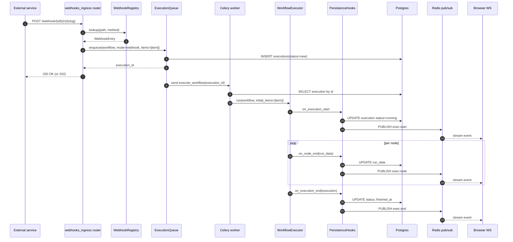

# Triggers, Worker, Webhooks

> The async + scheduled side of the system. Together they answer: "how does
> a non-manual run get from the outside world to `WorkflowExecutor.run()`?"

## `triggers/` — durable scheduling + activation

:material-folder: `src/weftlyflow/triggers/`

### Files

| File | Purpose |
| ---- | ------- |
| `manager.py` | :material-tag: `ActiveTriggerManager` — the orchestrator. |
| `scheduler.py` | :material-tag: `Scheduler` Protocol + `InMemoryScheduler` (APScheduler-backed). |
| `leader.py` | :material-tag: `LeaderLock` — single-firer election so cron triggers don't double-fire across replicas. |
| `poller.py` | :material-tag: `Poller` — runs `BasePollerNode`s on their interval. |
| `constants.py` | `SCHEDULE_KIND_INTERVAL`, `SCHEDULE_KIND_CRON`, queue names. |
| `__init__.py` | Public surface. |

### `triggers/manager.py` — `ActiveTriggerManager`

Where workflow activation turns into real listener registrations.

| Method | Purpose |
| ------ | ------- |
| `warm_up()` | On boot: load every `WebhookEntity` and `TriggerScheduleEntity` from DB and replay them into the in-memory `WebhookRegistry` + `Scheduler`. |
| `activate(workflow)` | Iterate trigger nodes; for each: call `_activate_webhook` or `_activate_schedule`; persist the resulting entity row. |
| `deactivate(workflow_id)` | Remove every webhook/schedule row for the workflow + unregister from in-memory stores. |
| `_activate_webhook(node)` | Generate a webhook id, derive a static path via `webhooks.paths.static_path`, register in the `WebhookRegistry`, persist `WebhookEntity`. |
| `_activate_schedule(node)` | Convert node parameters to a `ScheduleSpec`, ask the `Scheduler` to register it under the leader lock, persist `TriggerScheduleEntity`. |

Trigger node types are matched by string constant so the manager doesn't
import the node classes directly:

- `WEBHOOK_TRIGGER_TYPE = "weftlyflow.webhook_trigger"`
- `SCHEDULE_TRIGGER_TYPE = "weftlyflow.schedule_trigger"`

### `triggers/scheduler.py` — `Scheduler`

```python
@dataclass
class ScheduleSpec:
    kind: Literal["cron", "interval"]
    expression: str          # cron expression or interval seconds
    timezone: str = "UTC"

class Scheduler(Protocol):
    def register(self, *, schedule_id: str, spec: ScheduleSpec, callback: Callable[[], Awaitable[None]]) -> None: ...
    def unregister(self, schedule_id: str) -> None: ...
    def start(self) -> None: ...
    def shutdown(self) -> None: ...
```

`InMemoryScheduler` wraps `apscheduler.AsyncIOScheduler`. Each callback
enqueues an execution via the configured `ExecutionQueue`.

### `triggers/leader.py` — `LeaderLock`

Two implementations:

- `InMemoryLeaderLock` — single-instance dev. Always held.
- `RedisLeaderLock` — uses `SET NX PX` with a heartbeat. Only the elected
  instance fires schedules; others skip (their scheduler still ticks but the
  callback no-ops if `not leader.is_held()`).

### `triggers/poller.py` — `Poller`

Runs every registered `BasePollerNode` on its interval (declared in the
node's `spec.polling`). On each tick:

1. Build a synthetic `ExecutionContext` (the polling node receives no
   upstream items).
2. Call `node.poll(ctx)`.
3. If items returned, enqueue an execution with those items as
   `initial_items`.

---

## `worker/` — the Celery side

:material-folder: `src/weftlyflow/worker/`

### Files

| File | Purpose |
| ---- | ------- |
| `app.py` | The Celery application. Broker + backend wired from `settings`. |
| `tasks.py` | All Celery task definitions. |
| `execution.py` | `run_execution(execution_id)` — pulls the execution row, builds the executor, drives it. |
| `queue.py` | `ExecutionQueue` Protocol + `InlineExecutionQueue` (sync, dev) + `CeleryExecutionQueue` (production). |
| `idempotency.py` | Redis-backed dedup so a webhook retried by the upstream doesn't double-execute. |
| `sandbox_runner.py` | :material-shield-lock: Parent-side launcher for the Code-node sandbox. |
| `sandbox_child.py` | :material-shield-lock: Child entry — runs untrusted user code in an isolated subprocess. |

### `worker/app.py` — Celery configuration

See `src/weftlyflow/worker/app.py`. Notable settings:

- `task_acks_late=True` + `worker_prefetch_multiplier=1` — at-least-once
  semantics, no head-of-line blocking on long tasks.
- `task_routes` — `weftlyflow.execute_workflow` to `executions` queue,
  `weftlyflow.prune_audit_events` to `io`.
- `beat_schedule.prune-audit-events-daily` — 03:17 UTC, deliberately off-hour.

### `worker/tasks.py` — what the queue consumes

Three task families:

| Task | Queue | Purpose |
| ---- | ----- | ------- |
| `weftlyflow.execute_workflow(execution_id)` | `executions` | Fetch row → run → persist. |
| `weftlyflow.refresh_oauth_credential(credential_id)` | `io` | Renew an expiring OAuth2 token. |
| `weftlyflow.prune_audit_events()` | `io` | Daily Beat-driven retention task. |

Each task is a thin wrapper around an `async def` in `worker/execution.py`
(or the relevant subpackage). `asyncio.run` is used inside the Celery task
body to bridge sync ↔ async.

### `worker/execution.py` — `run_execution`

Loads the persisted workflow snapshot from `ExecutionEntity`, builds the
`WorkflowExecutor` with `PersistenceHooks`, drives it to completion. On
unhandled exception writes status=`error` and the safe error message before
re-raising for Celery retry semantics.

### `worker/queue.py` — `ExecutionQueue`

```python
class ExecutionQueue(Protocol):
    async def enqueue(
        self,
        *,
        workflow: Workflow,
        mode: ExecutionMode,
        initial_items: list[Item] | None = None,
    ) -> str: ...   # returns execution_id
```

`InlineExecutionQueue` runs the executor in-process (Phase 0/1 dev mode).
`CeleryExecutionQueue` writes the row + sends the task — the only two-line
swap that flips the system from inline to async.

### `worker/idempotency.py` — dedup cache

Key: `idem:{trigger_id}:{request_hash}`. Redis SETEX with TTL =
`webhook_idempotency_ttl_seconds`. The webhook handler checks before
enqueueing so duplicates short-circuit to the cached response.

### `worker/sandbox_runner.py` + `sandbox_child.py` — Code node sandbox

:material-shield-lock: The Code node lets users execute Python. Doing this
in-process would leak memory, exhaust CPU, and expose the parent's globals.
The sandbox solves this:

1. **Parent (`sandbox_runner.py`)** — `subprocess.Popen` of the child with
   `resource.setrlimit` for CPU + memory + file descriptors, `seccomp`
   filter via `prctl`, no network namespace where possible. Pipe carries
   request JSON in / response JSON out. Wall-clock timeout enforced from
   the parent.
2. **Child (`sandbox_child.py`)** — drops privileges, applies further
   `setrlimit`, reads the request, executes the user code under
   RestrictedPython (the same engine `expression/sandbox.py` uses),
   serialises the result, exits.

The child entry point is invoked via `python -m
weftlyflow.worker.sandbox_child` so it has zero of the parent's imports
loaded except the explicit re-imports it needs.

---

## `webhooks/` — the HTTP front-door for triggers

:material-folder: `src/weftlyflow/webhooks/`

### Files

| File | Purpose |
| ---- | ------- |
| `registry.py` | :material-tag: `WebhookRegistry` — in-memory `{path → WebhookEntry}`. |
| `handler.py` | :material-tag: `WebhookHandler` — routes a request to the registered entry, builds the initial `Item`, enqueues. |
| `parser.py` | :material-tag: `WebhookRequestParser` — extracts headers, body (JSON / form / raw), query, path params. |
| `paths.py` | `static_path(workflow_id, node_id)` + `pattern_path(...)`. |
| `types.py` | `WebhookEntry`, `WebhookRequest`, `WebhookResponse` dataclasses. |
| `constants.py` | Default response codes, allowed methods. |

### Path conventions

- **Static webhooks**: `/webhook/{workflow_id}/{node_id}/{slug}` — registered
  at activation, persisted as `WebhookEntity`.
- **Test webhooks**: `/webhook-test/...` — only valid while the editor is
  open against that workflow; consumed once.

### Flow on inbound request

The router `server/routers/webhooks_ingress.py` is just a delegating shim:

1. Parse the request via `WebhookRequestParser`.
2. Look up the entry in `WebhookRegistry` by path + method.
3. Optional auth check (basic / header / signature) per the trigger node's
   spec.
4. Idempotency check (`worker/idempotency.py`).
5. Build an `Item` from the request payload.
6. Enqueue an execution with `mode="webhook"` and that `Item` as
   `initial_items`.
7. Return the configured response (immediate-200 by default; some triggers
   wait for execution to finish and return `runData`).

## Sequence: webhook arrives, run completes



## Cross-references

- The executor that step 8 onwards runs through:
  [Domain → Engine → Nodes](domain-engine-nodes.md).
- The persistence hooks bridging engine ↔ DB:
  [Server & DB](server-db.md).
- Where the Code-node sandbox shares its compiler with `{{ ... }}`:
  [Auth, Credentials, Expression](auth-credentials-expression.md).
