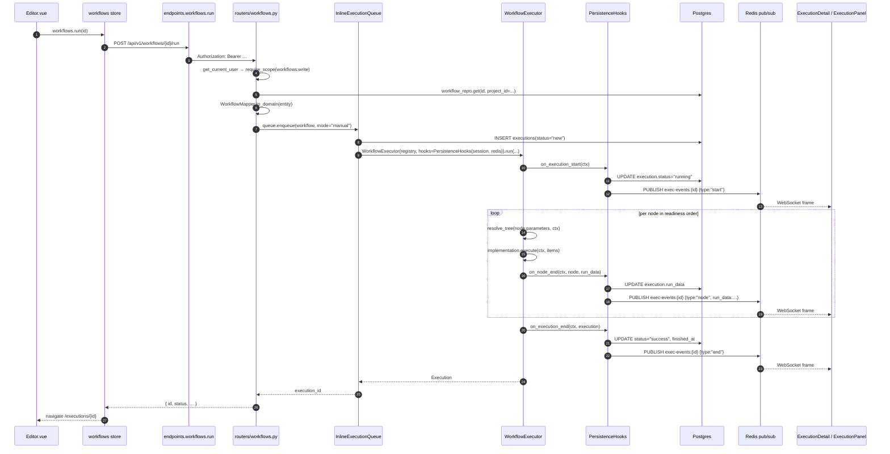
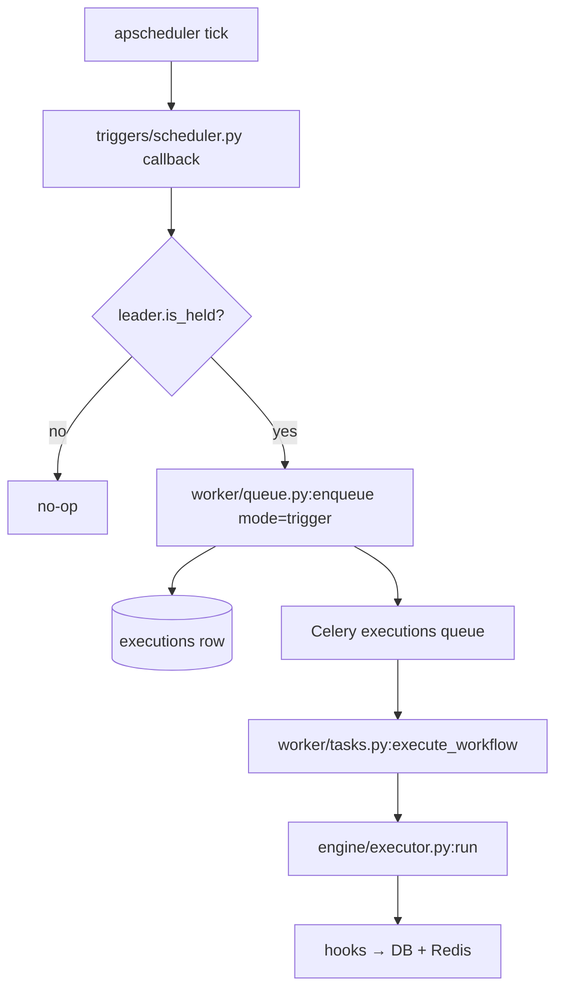

# Data-Flow Tracer

> Three end-to-end traces: a manual run from the editor, a webhook arrival, and
> a scheduled tick. Each step names the *exact* function that fires next.
> Use this page when something doesn't behave the way you expect — find the
> hop, open the file, set a breakpoint.

## Trace 1 — Manual run from the editor

The user clicks the green ▶ in `Editor.vue`.



### Files / functions touched (in order)

| Step | File | Symbol |
| ---- | ---- | ------ |
| 1 | `frontend/src/views/Editor.vue` | `executeWorkflow()` handler |
| 2 | `frontend/src/stores/workflows.ts` | `actions.run(id)` |
| 3 | `frontend/src/api/endpoints.ts` | `workflows.run(id)` |
| 4 | `src/weftlyflow/server/routers/workflows.py` | `POST /{id}/run` handler |
| 5 | `src/weftlyflow/server/deps.py` | `get_current_user` + `require_scope("workflows:write")` |
| 6 | `src/weftlyflow/db/repositories/workflow_repo.py` | `WorkflowRepository.get` |
| 7 | `src/weftlyflow/db/mappers/workflow.py` | `WorkflowMapper.from_entity` |
| 8 | `src/weftlyflow/server/mappers/workflow.py` | (validates schema, maps to domain — already done by router for write paths; for run, we go entity → domain directly) |
| 9 | `src/weftlyflow/worker/queue.py` | `InlineExecutionQueue.enqueue` |
| 10 | `src/weftlyflow/engine/executor.py:93` | `WorkflowExecutor.run` |
| 11 | `src/weftlyflow/server/persistence_hooks.py` | `PersistenceHooks.on_execution_start` |
| 12 | `src/weftlyflow/expression/resolver.py` | `resolve_tree(node.parameters, ctx)` |
| 13 | `src/weftlyflow/nodes/<node>/node.py` | `<Node>.execute(ctx, items)` |
| 14 | `src/weftlyflow/server/persistence_hooks.py` | `on_node_end` → `on_execution_end` |
| 15 | `src/weftlyflow/server/routers/executions.py` | `WS /executions/{id}/stream` (read side) |
| 16 | `frontend/src/stores/executions.ts` | `subscribe(id)` consumes the WS |
| 17 | `frontend/src/components/ExecutionPanel.vue` | re-renders on each frame |

## Trace 2 — A webhook arrives

External service POSTs to `/webhook/{workflow_id}/{node_id}/{slug}`.

```mermaid
flowchart LR
    A[POST /webhook/...]
    --> B[server/routers/webhooks_ingress.py]
    --> C[webhooks/parser.py:WebhookRequestParser.parse]
    --> D[webhooks/registry.py:WebhookRegistry.lookup]
    --> E{Auth required?}
    E -- yes --> F[verify HMAC / Basic / header]
    E -- no --> G
    F --> G[worker/idempotency.py:dedup_check]
    G --> H[worker/queue.py:CeleryExecutionQueue.enqueue]
    H --> I[(executions row, status=new)]
    H --> J[Celery executions queue]
    J --> K[worker/tasks.py:execute_workflow]
    K --> L[worker/execution.py:run_execution]
    L --> M[engine/executor.py:WorkflowExecutor.run]
    M --> N[hooks → DB + Redis pub/sub]
    N --> O[/api/v1/executions/{id}/stream WS/]
    A --> P[200 / 202 immediate response from B]
```

### Functions touched

| File | Symbol | Role |
| ---- | ------ | ---- |
| `server/routers/webhooks_ingress.py` | `webhook` route handler | Delegates to `WebhookHandler`. |
| `webhooks/parser.py` | `WebhookRequestParser.parse` | Extracts headers + JSON / form / raw body, query, path params. |
| `webhooks/registry.py` | `WebhookRegistry.lookup` | Path → `WebhookEntry`. |
| `webhooks/handler.py` | `WebhookHandler.handle` | Auth + idempotency + enqueue. |
| `worker/idempotency.py` | `dedup_check(key, ttl)` | Redis SETEX-based dedup. |
| `worker/queue.py` | `CeleryExecutionQueue.enqueue` | INSERT row + `apply_async`. |
| `worker/tasks.py` | `execute_workflow(execution_id)` | Celery entry. |
| `worker/execution.py` | `run_execution(execution_id)` | Build executor + drive. |
| `engine/executor.py` | `WorkflowExecutor.run` | The main loop. |

## Trace 3 — Scheduled tick (cron)

Beat or the in-memory scheduler fires the registered job.



The `LeaderLock.is_held()` gate is what makes horizontally-scaled API
replicas safe — only the elected instance fires the job.

## Trace 4 — Expression evaluation inside a node

When a node parameter contains `{{ ... }}`:

```
node.parameters: { "url": "https://api.x/{{ $json.id }}/items" }

  1. engine/executor.py builds ExecutionContext (ctx)
  2. executor calls resolve_tree(node.parameters, ctx)
        ↓
  3. expression/resolver.py:resolve_tree walks the dict
  4. Each string value → expression/tokenizer.py:contains_expression?
        ↓ yes
  5. tokenizer.tokenize(template) → [Literal, Expression, Literal]
  6. For each ExpressionChunk:
        a. resolver fetches compiled bytecode from LRU
           or expression/sandbox.py:compile_restricted_eval()
        b. expression/proxies.py:build_proxies(ctx) → globals dict
           ($json, $node, $now, $env, ...)
        c. expression/sandbox.py:eval(bytecode, globals, {})
           with thread-level deadline = expression_timeout_ms
  7. Stitch chunks back into a string (or return native value when
     is_single_expression is True).
  8. Resolved parameters handed to node.execute(ctx, items).
```

Errors at any step surface as `ExpressionError` subclasses; the executor
catches them in `_handle_node_exception` and routes the message through
`utils.redaction.safe_error_message` before persistence.

## Trace 5 — Credential read at execution time

When a node calls `ctx.credentials("openai")`:

```
ctx.credentials("openai")
  → ExecutionContext._credential_resolver.resolve(
        credential_id=node.credentials["openai"],
        project_id=workflow.project_id,
    )
  → credentials/resolver.py:DatabaseCredentialResolver.resolve
       1. CredentialRepository.get(id, project_id) → CredentialEntity
       2. cipher.decrypt(entity.encrypted_body) → dict (Fernet)
       3. Walk dict; for each value matching "${provider:ref}":
            credentials/external/registry.py:fetch(ref)
              → first SecretProvider whose name matches → fetch(ref)
                  (env / vault / 1password / aws)
       4. Return merged dict
  ← decrypted credentials dict (never logged)
```

## Trace 6 — Persisting the result

`PersistenceHooks.on_execution_end` is the final write:

```
hooks.on_execution_end(ctx, execution)
  → ExecutionRepository.update(id, {
        status: execution.status,
        finished_at: execution.finished_at,
        run_data: serialise(execution.run_data),
    })
  → If serialise(run_data) > binary_inline_limit_bytes:
        db/execution_storage.py:store_off_row(execution_id, payload)
          → write to fs / s3 according to settings
          → INSERT execution_data row, persist data_ref
        UPDATE executions.run_data = NULL, run_data_ref = '<scheme>:<key>'
  → Publish exec:end event on Redis
```

## How to use these traces when debugging

1. Reproduce the issue with one user-visible action.
2. Find the trace that matches (manual / webhook / schedule).
3. Open the file at the *first* hop where you suspect the deviation.
4. Set a breakpoint or add a structlog binding (`log.bind(diag="here")`).
5. Re-run; walk forward through the trace until the symptom appears.

The traces above are deliberately written as a **call sequence**, not a
component diagram — that's the right shape for "follow the code".
