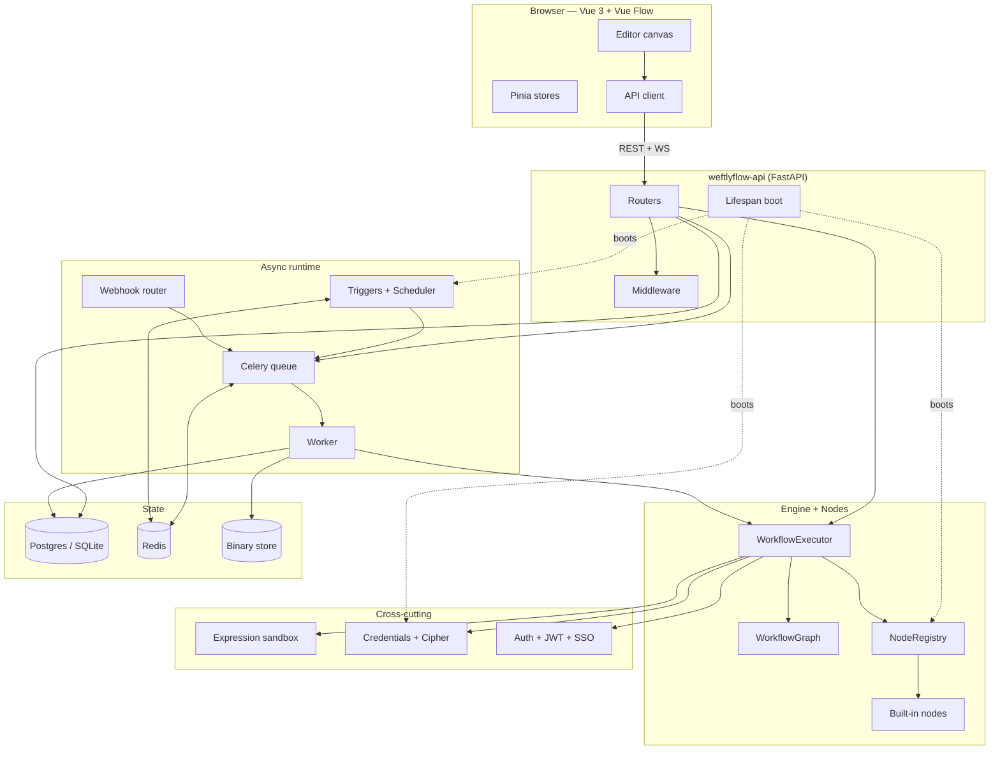

---
hide:
  - toc
---

:octicons-telescope-16: Source-code walkthrough

# The Weftlyflow Codebase — End-to-End

A complete, tracer-bullet tour through every folder, module, class, and method
in Weftlyflow — written for the developer who joined the project five minutes
ago and wants to be productive by lunchtime.

[:octicons-rocket-16: Start: How to read this project](onboarding.md){ .md-button .md-button--primary }
[:octicons-file-directory-16: Repo tour](repo-tour.md){ .md-button }
[:octicons-graph-16: Data-flow tracer](data-flow.md){ .md-button }
[:octicons-search-16: Backtrack any source](source-backtrack.md){ .md-button }

## What this document is

This is **the** developer onboarding artifact. If you can only read one thing
before touching the source, read this. It exists because:

- The codebase has **~700 Python modules** + a Vue 3 frontend, organised into
  a strict layered architecture. Browsing alphabetically misses the *why*.
- Each layer enforces a **dependency rule** (`server → engine → nodes → domain`)
  that is invisible until you see the diagrams.
- Most non-obvious files (`runtime.py`, `graph.py`, `proxies.py`, `resolver.py`)
  encode design decisions you'll otherwise re-discover the hard way.

This walkthrough is layered top-down:

-   :material-school:{ .lg .middle } &nbsp;**[How to read this project](onboarding.md)**

    ---

    A guided 7-step learning path. Walks you from `pyproject.toml` → first
    workflow execution, in the order that builds mental models fastest.

-   :material-folder-open:{ .lg .middle } &nbsp;**[Repository tour](repo-tour.md)**

    ---

    Annotated tree of every top-level file and directory — what it is, why it
    exists, when you'll need it.

-   :material-language-python:{ .lg .middle } &nbsp;**[Backend (Python)](backend/index.md)**

    ---

    The 13 backend subpackages, layered. Each module gets folder, class, and
    method-level coverage with file:line refs.

-   :material-vuejs:{ .lg .middle } &nbsp;**[Frontend (Vue 3)](frontend.md)**

    ---

    The Vue 3 + Vue Flow editor, Pinia stores, the API client, routing, and
    every component file.

-   :material-flow-chart:{ .lg .middle } &nbsp;**[Data-flow tracer](data-flow.md)**

    ---

    Follow a webhook from the wire all the way to a `NodeRunData` row, with
    the exact functions touched at each hop.

-   :material-arrow-decision-outline:{ .lg .middle } &nbsp;**[Source-code backtracking](source-backtrack.md)**

    ---

    "I see this symbol — where does it come from?" A symbol → file map for
    every cross-cutting type, error, registry, and constant.

## Map of the system

## Conventions used throughout

| Symbol | Meaning |
| ------ | ------- |
| :material-folder: | A folder (Python subpackage or frontend module) |
| :material-file-code: | A specific source file |
| :material-tag: | A class or dataclass |
| :material-function: | A free function or method |
| :material-link-variant: | A cross-reference to another walkthrough page |
| :material-database: | Touches persistent storage |
| :material-shield-lock: | Security-sensitive — read carefully before editing |
| :material-flash: | Hot path — performance-sensitive |

!!! tip "Pair this with the API reference"
    Every `class:` / `func:` link in this walkthrough resolves into the
    auto-generated [API reference](../reference/index.md) on click — that's where
    you'll find full signatures, type annotations, and source links.

!!! info "Provenance"
    Weftlyflow is an original Python implementation. Architectural decisions,
    naming, and the layering rules referenced throughout this walkthrough are
    canonicalised in `weftlyinfo.md` at the repo root.
